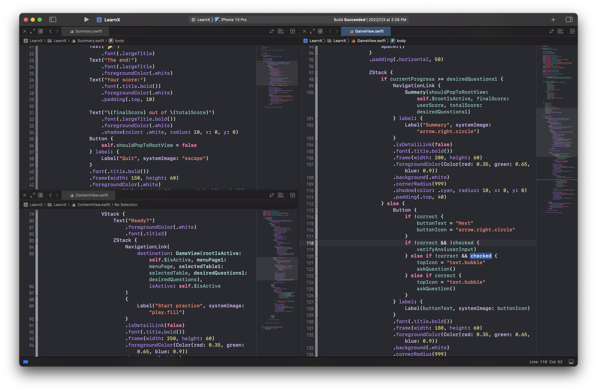
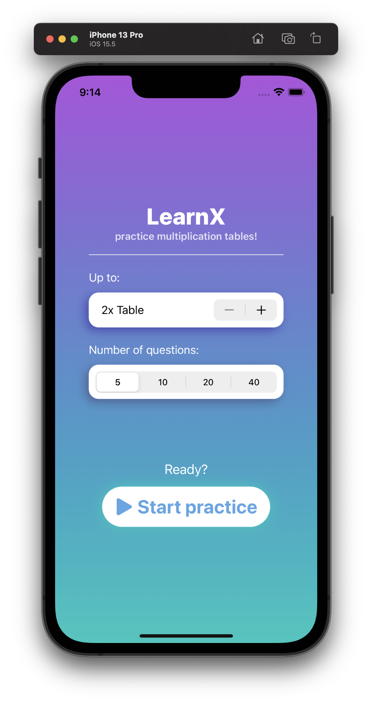
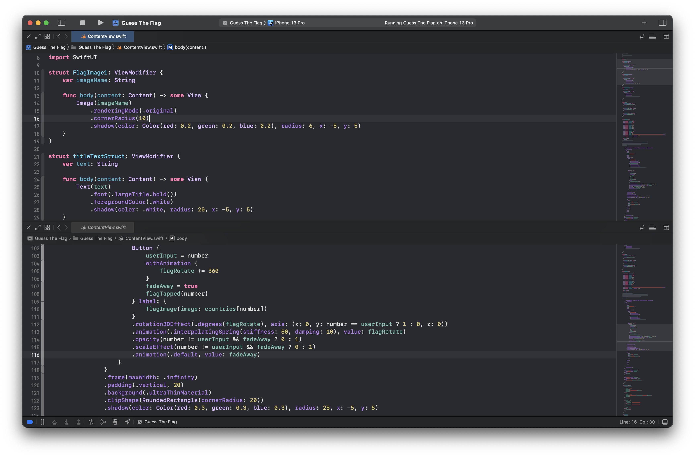
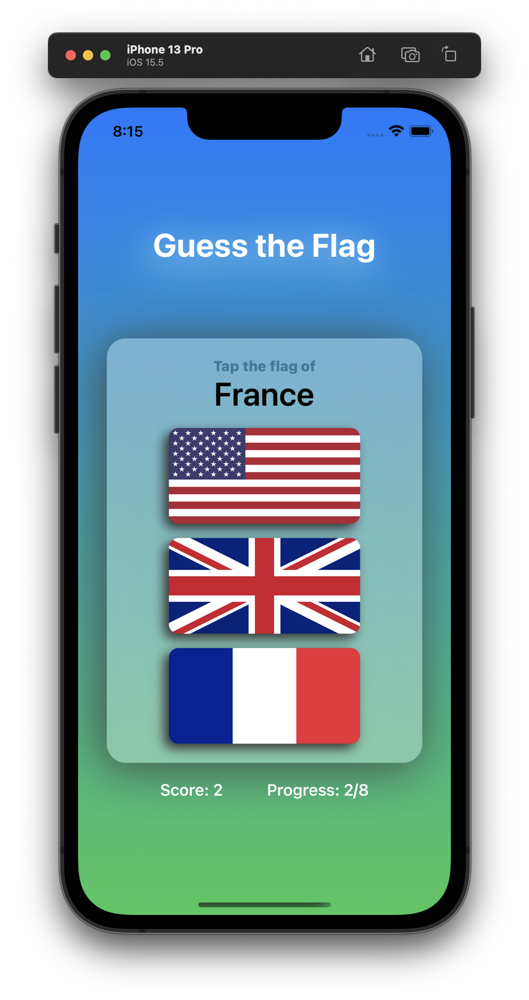
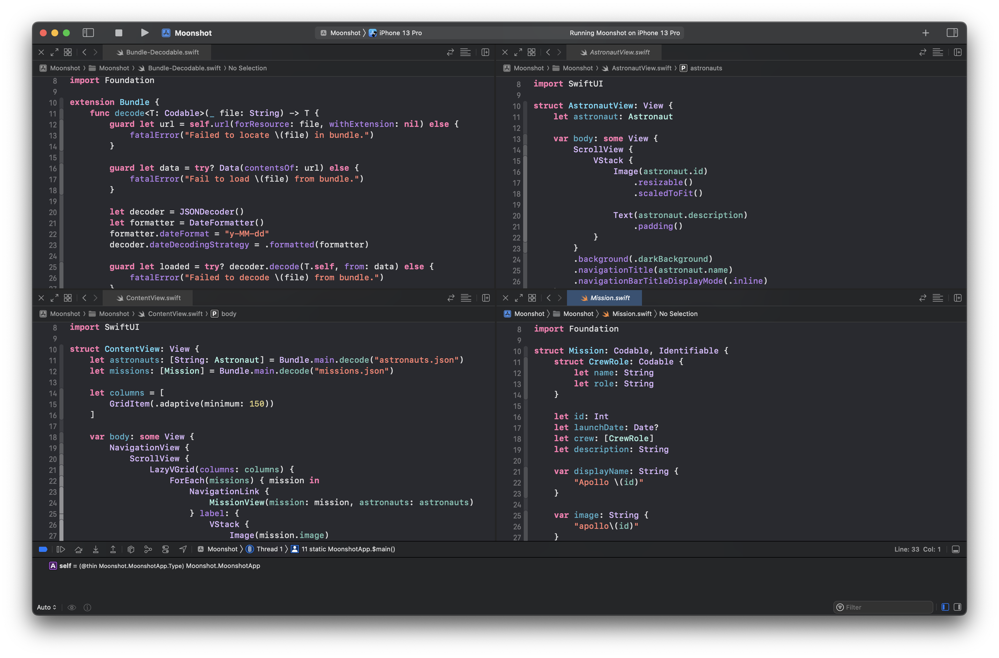
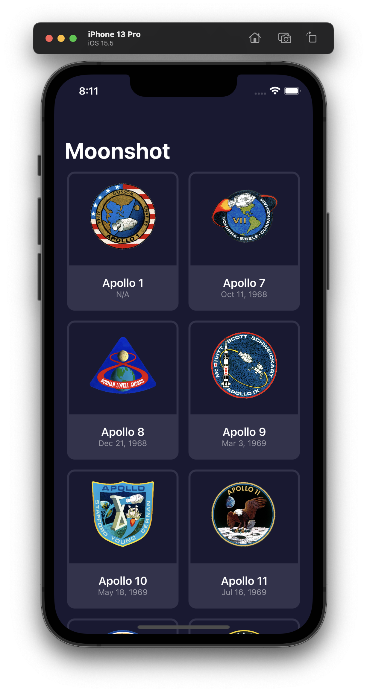
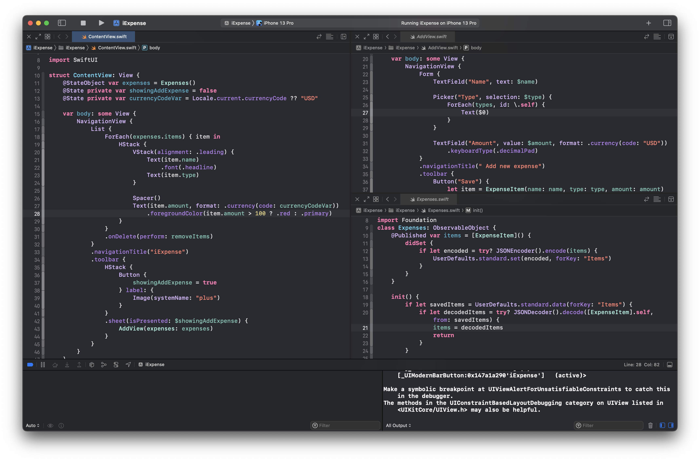
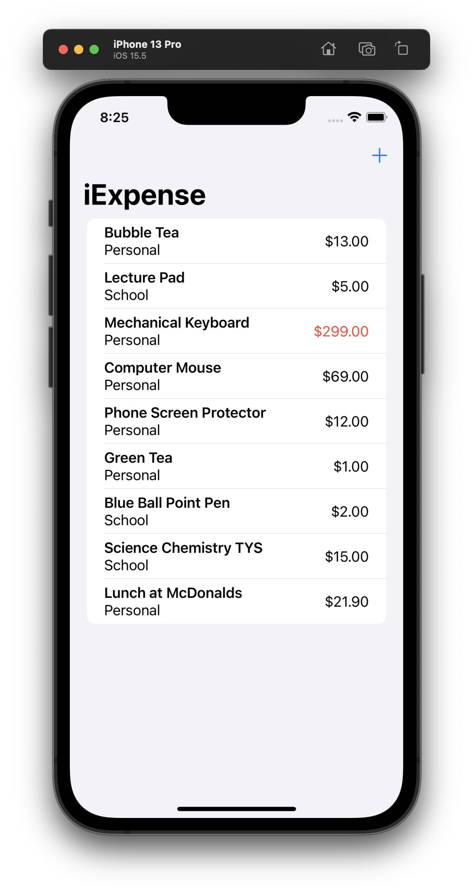
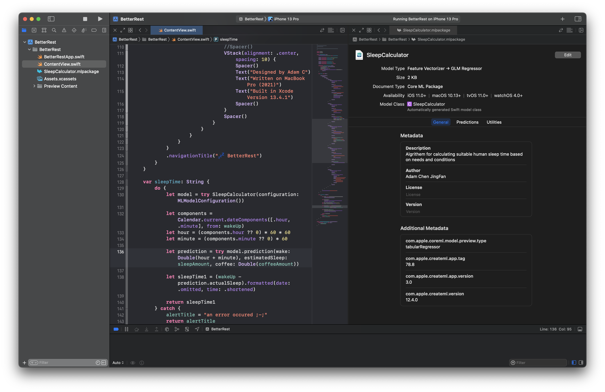
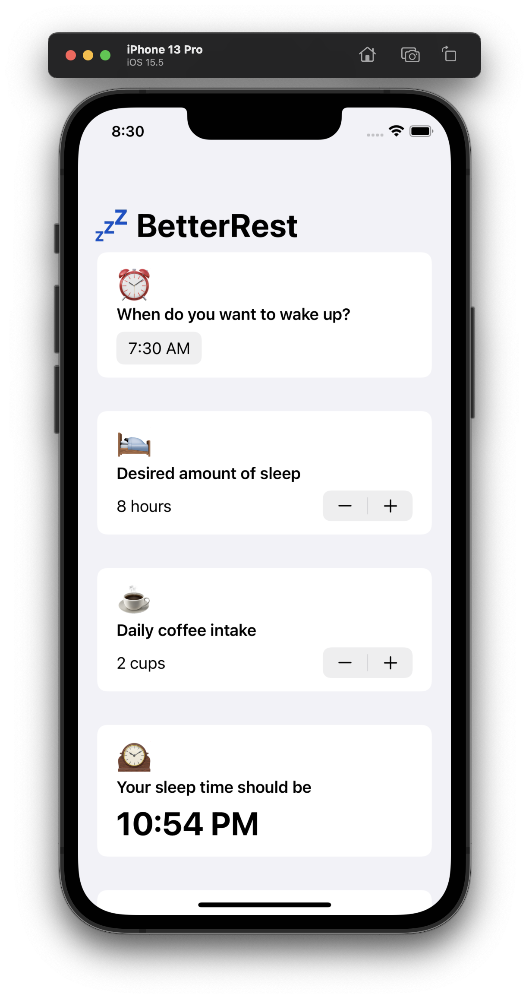

<h1>👋 Hello world! I am <i>Adam C</i></h1>

<h4 align="left">
  ✨ A generic tech enthusiast trying to make apps
</h4>

Why did I learn 8 programming languages:

- **Python**: My starter language.
- **Swift**: Building iPhone and Mac apps.
- **C#**: For making native Windows apps.
- **C**: To understand a command-line tool (displayplacer).
- **C++**: Teach the neighbour's child.
- **Objective-C**: Native interaction with macOS services.
- **Dart**: Required by Flutter framework to build cross-platform apps.
- **Rust**: Hype for being the C++ replacement.
*Everything* is going according to **plan**.
 

<!--  
# Have a look at what I've been working on 👨‍💻

Pikvey: The all-in-one anime wallpaper solution for the weebs.
:-:

Lessify Music Fetching Tool (Click to download)
:-:
 -->

  
<!-- Xcode Project Window (Click to view repository)|iOS App(s)
:-:|:-:
|
|
|
|
|
 -->

# "There is no place like `127.0.0.1`."

Knows my way around these operating systems:

Speaks these (computer) languages:

Takes advantage of these tools:

<!--

-->

  

[2]:https://en.wikipedia.org/wiki/Python_(programming_language)
[3]:https://en.wikipedia.org/wiki/Swift_(programming_language)
[4]:https://en.wikipedia.org/wiki/Linux
[5]:https://en.wikipedia.org/wiki/HTML
[6]:https://en.wikipedia.org/wiki/CSS
[7]:https://developer.apple.com/xcode/swiftui/
[8]:https://en.wikipedia.org/wiki/Computer_security
[9]:https://www.dart.dev
[10]:https://www.flutter.dev
[11]:https://learn.microsoft.com/en-us/dotnet/csharp/tour-of-csharp/
[12]:https://en.wikipedia.org/wiki/Extensible_Application_Markup_Language

<!---
Wind-Explorer/Wind-Explorer is a ✨ special ✨ repository because its `README.md` (this file) appears on your GitHub profile.
You can click the Preview link to take a look at your changes.
--->
